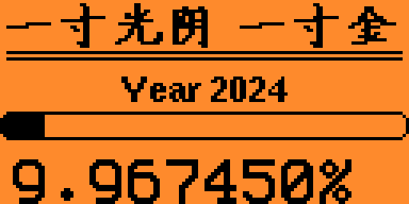

# flipperzero-YearProgress

[中文文档](README-zh.md)

Display A progress bar and percent for now in this year



This repo contains a simple App for the Flipper Zero that can calculate the ratio of the total seconds since the beginning of this year to now to the total of seconds this year, and display progress bar and persent for this ratio.

The purpose of this App reminds users to cherish Time.

## Build

Install [uFBT](https://github.com/flipperdevices/flipperzero-ufbt) build tool on your system.

```bash
pip install ufbt
```

Clone the source code.

```bash
git clone https://github.com/SocialSisterYi/flipperzero-YearProgress
```

Use uFBT to build this App (need wait toolchain auto download for first time use).

```bash
ufbt
```

## Installing

Connect you Flipper via USB cable after uFBT build, and run following command.

```bash
ufbt launch
```

Also, find building result file `./dist/yaer_progress.fap` or download `.fap` from [Release](https://github.com/SocialSisterYi/flipperzero-YearProgress/releases).

Then you can use [qFlipper](https://flipperzero.one/downloads) to transmit file, upload this into `/ext/apps/tools/`.
